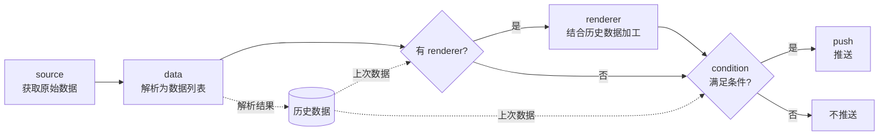

  

<h1 align="center">Mimosa</h1>

一体化 <i>爬虫/数据监控/推送</i> 工具

## 功能特点
- 爬虫、数据解析、推送均为模块化设计
- 任务文件/功能模块支持热重载（`reload` 命令）

## 运行
1. 安装依赖：`pip install -r requirements.txt`
2. 复制 `config.example.json` 为 `config.json` 并按需修改
3. 初始化：`python start_up.py`（创建外部模块目录、安装外部模块依赖、创建空任务文件）
4. 启动：`python main.py`

## 命令
- exit: 退出（Ctrl+C 同效）
- help: 显示命令列表
- reload: 重载功能模块和任务文件（不会重新读取 config.json）
- start \<任务名\>: 开始任务
- stop \<任务名\>: 暂停任务
- clear \<任务名\>: 清除任务历史数据
- save: 保存任务历史数据（运行中每 5 分钟也会自动保存）

## 配置文件
> JSON，固定为 config.json
- LOG_LEVEL: 日志级别，默认`0`。`0`/`1`: DEBUG，`2`: INFO，`3`: WARNING，`4`: ERROR；也可直接填级别名，如`"INFO"`
- TASK_FILE: 任务文件名，默认`tasks.json`
- HISTORY_FILE: 历史数据文件名，默认`history.pkl`
- MAX_WORKERS: 同时执行的任务数上限，默认`8`
- EXTERNAL_MODULE_FOLDER: 外部模块目录（相对于项目根目录），默认为空即不加载。目录下的 `source`/`data`/`renderer`/`push` 子目录与内置模块目录用法相同，`requirements.txt` 会在 `start_up.py` 时安装

## 任务文件
> JSON 列表（详见 tasks_demo.json），每一项为一个任务，除以下配置项外可视需求添加

### 任务
- name: 任务名
- type: `static`
- cron: 运行时间，标准 crontab 格式`分 时 日 月 周`（本地时间），如`"*/10 * * * *"`每 10 分钟、`"0 9 * * mon-fri"`工作日 9 点；也支持`@hourly`、`@daily`、`@weekly`、`@monthly`、`@yearly`
- interval: 数据更新间隔（秒），与 cron 二选一
    > 程序停止期间错过的运行，启动后会补跑一次（不会逐次补跑）；新任务及 clear 之后的任务会立即运行一次。
- startup_data: 初始数据，作为首次更新（或 clear 之后）时的上次数据
- running: 启动时是否运行，默认`true`
- source / data / renderer（可选） / condition / push: 见下

#### source 数据源
> 模块存放于source文件夹下
- type: 模块名，须与文件名相同
- url: 请求地址，str / dict，支持动态获取（见下）
    > 所有以 `url` 开头的字段均支持动态获取 

    ##### url 动态获取
    > 当url为dict时
    - base: url生成模板，按format函数格式，如 `http://xxx/{0}`
    - source: 与 数据源 source 格式相同
    - data: 与 数据解析 data 格式相同，解析结果依次填入 base
    > 动态获取的字段会被保存至 `*+原字段名` 字段中，如 `url` -> `*url`。
    
    > 在source数据源模块中建议使用带*字段名访问所有动态获取字段。
- 其他字段由各模块自定义，内置模块：
    - no_auth: 通用 HTTP 请求。`method`（`GET`/`POST`），`payload`（POST 数据），可选 `headers`、`cookies`、`proxies`、`encoding`、`timeout`（秒，默认`10`）
    - xpd / ups: 物流查询。`tracking_id`
    - tplink_host_online: TP-Link 路由器在线设备列表。`router_ip`、`key`

#### data 数据解析 
> 列表，模块存放于data文件夹下。每一项从数据源的原始数据中解析出一个数据，按顺序对应条件中的 `$0`、`$1`……
- type: 模块名，须与文件名相同
- postprocess: 后处理，与data段格式相同，以上一步的解析结果作为输入
- 其他字段由各模块自定义，内置模块：
    - json: `route`，取值路径列表，如 `["data", 0, "title"]`。路径中的 `"*"` 表示对列表中每个元素（或对象的每个值）继续按之后的路径取值，结果组成列表，如 `["data", "list", "*", "title"]` -> `["A", "B"]`；可选 `skip_missing`（默认`false`），为`true`时跳过缺少该 key 的元素，否则视为解析失败
    - regexp: `exp` 正则表达式，`index` 取第几个匹配
    - xpath: `xpath` 表达式，`index` 取第几个结果；`index` 小于 0 时拼接所有结果

> 当数据源请求失败、或任一数据解析项失败时，本次更新会被跳过：不判断条件、不推送，历史数据保持不变，等下个周期重试。

#### renderer 渲染器（可选）
> 当需要复杂处理时对当前和历史数据进行自定义处理，模块存放于renderer文件夹下
- type: 模块名，须与文件名相同
- 其他自定义参数
> 当renderer配置项存在时，condition与push会使用renderer的返回值作为输出，且condition中上次数据变量不可用。

> 当使用renderer时，建议直接将输出字符串处理好（即实现condition的功能），且在返回数据中携带是否推送的标志，在condition中直接判断该标志即可。

#### condition 条件判断 
> 列表，从前到后依次计算（无优先级），结果为真时推送；空列表表示每次都推送
- conn: 与之前结果的逻辑连接，[and, or]，首个需为and
- var: 判断符前变量
- op: 判断符，[==, !=, <, >, <=, >=, in]，`in` 表示 var 包含于 target（列表或字符串）
- target: 判断符后变量

    ##### 变量
    > 以字符串类型输入以下内容时将解析为变量，否则以原样判断
    - $n: 本次更新的第n个数据
    - #n: 上次更新的第n个数据 （使用renderer时不可用）
    - *timestamp: 当前时间戳

#### push 推送 
> 推送配置，单个对象或列表（推送到多个渠道），模块存放于push文件夹下
- type: 模块名，须与文件名相同
- text: 消息模板，按format函数格式，`{0}`、`{1}`……为本次数据（或renderer输出）
- 其他字段由各模块自定义，内置模块：
    - telegram: `bot_token`、`to`（chat id）
    - file: `file`，追加写入的文件路径（文件须已存在）
    - personal: 自建推送服务。`url`、`token`、`title`、`to`、`push_type`

## Workflow 工作流程

## TODO
- 数据解析部分支持表达式
