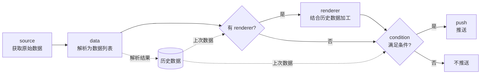

<p align="center">
  
</p>
<h1 align="center">Mimosa</h1>
<p align="center">一体化 <i>爬虫/数据监控/推送</i> 工具</p>


## 功能特点
- 爬虫、数据解析、推送均为模块化设计，可在外部目录中编写自己的插件
- 任务按 crontab 表达式或固定间隔运行，各任务并行执行互不阻塞
- 任务文件/功能模块支持热重载（`reload` 命令）
- 网页面板：查看任务状态和日志，启停、新增、编辑任务
- 支持 Docker 部署

## 运行
> 需要 Python 3.12
1. 安装依赖：`pip install -r requirements.txt`
2. 复制 `config.example.json` 为 `config.json` 并按需修改
3. 启动：`python main.py`（外部模块目录和任务文件不存在时会自动创建）

> 外部插件有依赖时，需先执行 `pip install -r external/requirements.txt`

## 命令
- exit: 退出（Ctrl+C 同效）
- help: 显示命令列表
- reload: 重载功能模块和任务文件（不会重新读取 config.json）
- start \<任务名\>: 开始任务
- stop \<任务名\>: 暂停任务
- clear \<任务名\>: 清除任务历史数据
- save: 保存任务历史数据（运行中每 5 分钟也会自动保存）

> start / stop（包括网页面板中的启停）只在本次运行中生效，不会写回任务文件；reload 后各任务的启停状态恢复为任务文件中 `running` 的设置

## 配置文件
> JSON，固定为 config.json
- LOG_LEVEL: 日志级别，默认`0`。`0`/`1`: DEBUG，`2`: INFO，`3`: WARNING，`4`: ERROR；也可直接填级别名，如`"INFO"`
- TASK_FILE: 任务文件名，默认`tasks.json`
- HISTORY_FILE: 历史数据文件名，默认`history.pkl`
- MAX_WORKERS: 同时执行的任务数上限，默认`8`
- EXTERNAL_MODULE_FOLDER: 外部模块目录（相对于项目根目录），默认为空即不加载。目录下的 `source`/`data`/`renderer`/`push` 子目录与内置模块目录用法相同（见[插件开发](#插件开发)），其中的 `requirements.txt` 需手动安装（Docker 中会自动安装）
- DASHBOARD: 是否开启网页面板，默认`false`
- DASHBOARD_HOST: 面板监听地址，默认`127.0.0.1`（仅本机可访问）。改为`0.0.0.0`对外开放时，务必设置 DASHBOARD_TOKEN
- DASHBOARD_PORT: 面板端口，默认`8080`
- DASHBOARD_TOKEN: 面板访问令牌，默认为空即不校验。设置后网页首次访问时会要求输入
- BOOKMARK_FILE: 面板配置书签的保存文件，默认为任务文件同目录下的 `bookmarks.json`（书签按原样保存配置内容，可能包含 token 等敏感信息）

## Docker
镜像使用 `config.docker.json` 作为配置，`external` 目录挂载到宿主机，其中保存外部插件、`requirements.txt`、`tasks.json`、`history.pkl` 和面板书签 `bookmarks.json`。容器每次启动前会安装 `external/requirements.txt` 中的依赖（如果有）。
```
docker build -t mimosa .
docker run -d --name mimosa --stop-timeout 30 -v ./external:/app/external -p 127.0.0.1:8080:8080 mimosa
```
> `-v ./external` 的相对路径写法需要 Docker 23 及以上；较旧版本或 Windows PowerShell 中可写为 `-v ${PWD}/external:/app/external`
- 面板在容器内监听 `0.0.0.0`，对外暴露范围由 `-p` 决定；去掉 `127.0.0.1:` 对外开放时务必设置 DASHBOARD_TOKEN
- 若 `external/config.json` 存在，则使用它替代镜像内置的配置（可避免把 token 打包进镜像）
- cron 按容器时区计算，默认 `Asia/Shanghai`，可用 `-e TZ=...` 修改
- 容器中没有交互式输入，可用面板控制；也可以用 `docker run -dit ...` 启动，再 `docker attach mimosa` 输入命令，按 Ctrl+P Ctrl+Q 退出（Ctrl+C 会停止容器）
- `docker stop` 时会等待执行中的任务并保存历史，`--stop-timeout 30` 留出足够时间

## 网页面板
开启 DASHBOARD 后访问 `http://127.0.0.1:8080/`：
- 查看每个任务的状态（运行中/执行中/已暂停/配置无效）、上次/下次运行时间、最近一次结果（成功·已推送 / 成功·未触发 / 失败原因）和最新数据
- 启动/暂停任务，清空任务历史数据
- 新增任务：在预填的模板上修改，校验通过后追加到任务文件并立即生效
- 复制任务：以已有任务的配置为模板（名称自动加 `_copy` 后缀），修改后保存为新任务
- 试运行：在编辑/新增/复制任务时，用当前（未保存的）配置运行到推送之前，逐步显示请求地址、原始数据、每项解析结果、renderer 输出、每条条件的实际值与结果，以及正式运行时是否会推送；不推送、不写历史、不修改任务文件（Ctrl+Enter）。注意 source 仍会真实发出请求
- 配置书签：在编辑/新增/复制任务时，可将当前配置中的模块（source、data 或其中一项、renderer、condition 或其中一条、push 或其中一个渠道）收藏为书签，之后在任意任务中一键插入：source/renderer 为替换，data/condition/push 可选追加或替换（Ctrl+Z 可撤销）
- 编辑任务配置：校验通过后写入任务文件并立即生效，不影响其他任务；配置无效未能加载的任务也可在此修复
- 重载全部插件模块和任务文件
- 查看最近 100 条日志

> 编辑保存会以 4 空格缩进重写整个任务文件。面板的所有操作与命令行命令在同一主循环中依次执行。

### HTTP API
面板页面使用以下接口，也可供脚本调用。设置了 DASHBOARD_TOKEN 时，请求需带 `X-Token` 请求头。返回 JSON，出错时为 `{"error": "原因"}`。

| 方法 | 路径 | 说明 |
|---|---|---|
| GET | `/api/tasks` | 全部任务的状态 |
| POST | `/api/tasks` | 新增任务，请求体为任务配置 |
| GET | `/api/tasks/<name>/config` | 读取任务文件中该任务的配置 |
| PUT | `/api/tasks/<name>/config` | 修改任务配置，请求体为新的任务配置 |
| POST | `/api/tasks/<name>/start` | 开始任务 |
| POST | `/api/tasks/<name>/stop` | 暂停任务 |
| POST | `/api/tasks/<name>/clear` | 清除任务历史数据 |
| POST | `/api/reload` | 重载全部插件模块和任务文件 |
| POST | `/api/dry-run` | 试运行，请求体为 `{"task": 任务配置, "name": 正在编辑的任务名（可选，用于取其历史数据）}` |
| GET | `/api/logs` | 最近 100 条日志 |
| GET | `/api/bookmarks` | 全部配置书签 |
| POST | `/api/bookmarks` | 新增书签，请求体为 `{"name": ..., "kind": "source/data/renderer/condition/push", "value": ...}` |
| DELETE | `/api/bookmarks/<id>` | 删除书签 |

状态码：`400` 配置或请求错误（含修改不存在的任务），`401` token 错误，`404` 启停、清除、读取配置时任务不存在，`504` 主循环繁忙（如 reload 正在等待任务结束）

## 任务文件
> JSON 列表（详见 tasks_demo.json），每一项为一个任务，除以下配置项外可视需求添加

### 任务
- name: 任务名
- type: `static`
- cron: 运行时间，标准 crontab 格式`分 时 日 月 周`（本地时间），如`"*/10 * * * *"`每 10 分钟、`"0 9 * * mon-fri"`工作日 9 点；也支持`@hourly`、`@daily`、`@weekly`、`@monthly`、`@yearly`
- interval: 数据更新间隔（秒），与 cron 二选一
    > 程序停止期间错过的运行，启动后会补跑一次（不会逐次补跑）；新任务及 clear 之后的任务会立即运行一次。
- startup_data: 初始数据，作为首次更新（或 clear 之后）时的上次数据
- running: 启动时是否运行，默认`true`（运行中的启停不会写回此项）
- source / data / renderer（可选） / condition / push: 见下

#### source 数据源
> 模块存放于source文件夹下
- type: 模块名，须与文件名相同
- url: 请求地址，str / dict，支持动态获取（见下）
    > 所有以 `url` 开头的字段均支持动态获取 

    ##### url 动态获取
    > 当url为dict时
    - base: url生成模板，按format函数格式，如 `http://xxx/{0}`
    - source: 与 数据源 source 格式相同
    - data: 与 数据解析 data 格式相同，解析结果依次填入 base
    > 动态获取的字段会被保存至 `*+原字段名` 字段中，如 `url` -> `*url`。
    
    > 在source数据源模块中建议使用带*字段名访问所有动态获取字段。
- 其他字段由各模块自定义，内置模块：
    - no_auth: 通用 HTTP 请求。`method`（`GET`/`POST`），`payload`（POST 数据），可选 `headers`、`cookies`、`proxies`、`encoding`、`timeout`（秒，默认`10`）
    - xpd / ups: 物流查询。`tracking_id`
    - tplink_host_online: TP-Link 路由器在线设备列表。`router_ip`、`key`

#### data 数据解析 
> 列表，模块存放于data文件夹下。每一项从数据源的原始数据中解析出一个数据，按顺序对应条件中的 `$0`、`$1`……
- type: 模块名，须与文件名相同
- postprocess: 后处理，与data段格式相同，以上一步的解析结果作为输入
- 其他字段由各模块自定义，内置模块：
    - json: `route`，取值路径列表，如 `["data", 0, "title"]`。路径中的 `"*"` 表示对列表中每个元素（或对象的每个值）继续按之后的路径取值，结果组成列表，如 `["data", "list", "*", "title"]` -> `["A", "B"]`；可选 `skip_missing`（默认`false`），为`true`时跳过缺少该 key 的元素，否则视为解析失败；可选 `allow_missing`（默认`false`），为`true`时取不到的值记为`null`而不视为解析失败（路径中取不到时结果为`null`，`"*"` 中取不到的元素保留为`null`；与 `skip_missing` 同时开启时，`"*"` 中的元素按 `skip_missing` 跳过）
    - regexp: `exp` 正则表达式，`index` 取第几个匹配；`index` 为 `"*"` 时返回全部匹配组成的列表（正则含多个分组时每项为各分组组成的列表）
    - xpath: `xpath` 表达式，`index` 取第几个结果；`index` 小于 0 时拼接所有结果；`index` 为 `"*"` 时返回全部结果组成的列表（选中元素时取其文本内容）
    > `index` 为 `"*"` 时没有匹配结果会得到空列表，不视为解析失败

> 当数据源请求失败、或任一数据解析项失败时，本次更新会被跳过：不判断条件、不推送，历史数据保持不变，等下个周期重试。

#### renderer 渲染器（可选）
> 当需要复杂处理时对当前和历史数据进行自定义处理，模块存放于renderer文件夹下
- type: 模块名，须与文件名相同
- 其他自定义参数
> 当renderer配置项存在时，condition与push会使用renderer的返回值作为输出，且condition中上次数据变量不可用。

> 当使用renderer时，建议直接将输出字符串处理好（即实现condition的功能），且在返回数据中携带是否推送的标志，在condition中直接判断该标志即可。

#### condition 条件判断 
> 列表，从前到后依次计算（无优先级），结果为真时推送；空列表表示每次都推送
- conn: 与之前结果的逻辑连接，[and, or]，首个需为and
- var: 判断符前变量
- op: 判断符，[==, !=, <, >, <=, >=, in, contains_any, contains_all, matches]
    - `in`: var 包含于 target
    - `contains_any` / `contains_all`: var 包含 target 列表中的任意一个 / 全部，如 `{"var": "$0", "op": "contains_any", "target": ["抽奖", "福利"]}`
    - `matches`: var 能匹配 target 正则表达式（`re.search`），如 `"抽奖|福利"`
    > “包含”对字符串按子串判断，对列表按元素判断；`matches` 对列表时任一元素匹配即可
- target: 判断符后变量
- ignore_case: 可选，为`true`时忽略大小写
- not: 可选，为`true`时对本条结果取反，如“不包含任何屏蔽词”
    > 判断出错（如类型不符、var 为 null、正则错误）时本条结果为假，`not` 不会将其变为真

    > 需要“包含其中之一”时请使用 `contains_any` 而非多条 `or`：条件按顺序计算没有优先级，`A and B or C` 的结果为 `(A and B) or C`

    ##### 变量
    > 以字符串类型输入以下内容时将解析为变量，否则以原样判断
    - $n: 本次更新的第n个数据
    - #n: 上次更新的第n个数据 （使用renderer时不可用）
    - *timestamp: 当前时间戳

#### push 推送 
> 推送配置，单个对象或列表（推送到多个渠道），模块存放于push文件夹下
- type: 模块名，须与文件名相同
- text: 消息模板，按format函数格式，`{0}`、`{1}`……为本次数据（或renderer输出）；列表类型的数据会以 `['A', 'B']` 的形式显示
- 其他字段由各模块自定义，内置模块：
    - telegram: `bot_token`、`to`（chat id）
    - file: `file`，追加写入的文件路径（文件须已存在）
    - personal: 自建推送服务。`url`、`token`、`title`、`to`、`push_type`

## 插件开发
插件为单个 `.py` 文件，放在对应目录（内置目录或外部模块目录下的 `source`/`data`/`renderer`/`push`），文件名即任务配置中的 `type`。外部插件不能与内置插件同名，否则不会被加载。修改后执行 `reload` 即可生效。

| 类型 | 需要实现的函数 | 参数 | 返回值 |
|---|---|---|---|
| source | `get_source(source)` | 任务的 source 配置（动态获取的字段为 `*url` 等） | 原始数据，通常为字符串 |
| data | `parse_data(raw_data, data_config_item)` | 原始数据（postprocess 时为上一步结果）、该项 data 配置 | 解析出的一个数据 |
| renderer | `do_render(render_config, data, hist_data)` | renderer 配置、本次数据列表、上次数据列表 | 列表，供 condition（`$n`）和 push（`{n}`）使用 |
| push | `do_push(push_config, data)` | 推送配置、本次数据（或renderer输出） | `(是否成功, 说明文字)` |

- source 抛出异常或返回 `None`、data 抛出异常时，视为本次抓取失败（不推送、保留历史）
- 请求网络时务必设置 `timeout`，避免任务卡住
- 日志使用标准 logging：`logger = logging.getLogger(__name__)`
- 外部插件需要的第三方包写入外部模块目录的 `requirements.txt`

## Workflow 工作流程


## TODO
- 数据解析部分支持表达式
